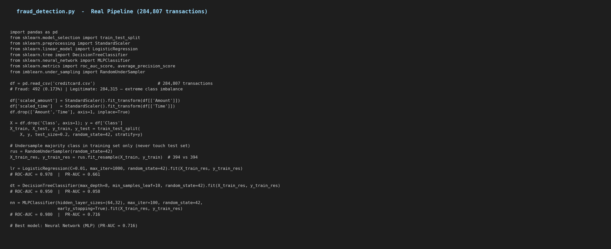
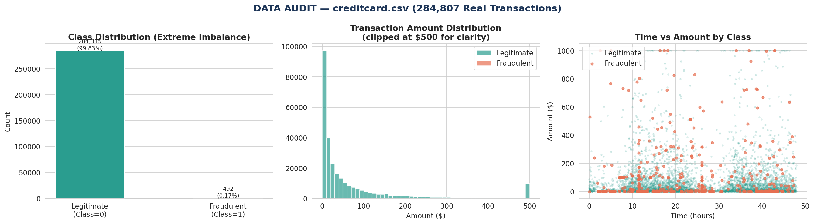
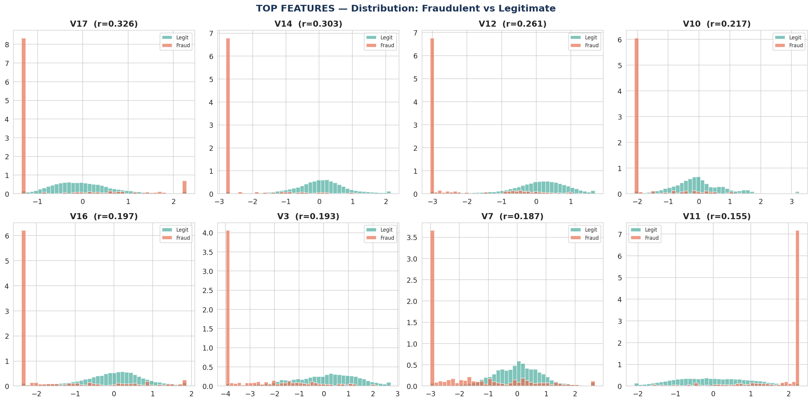
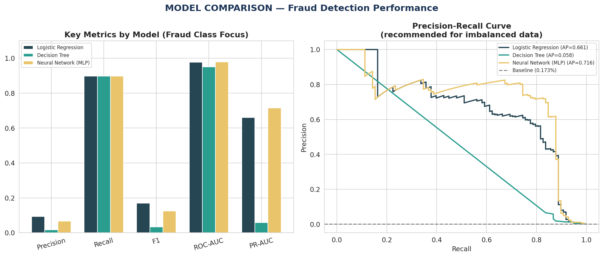
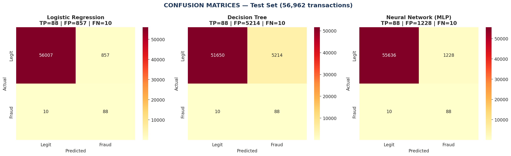
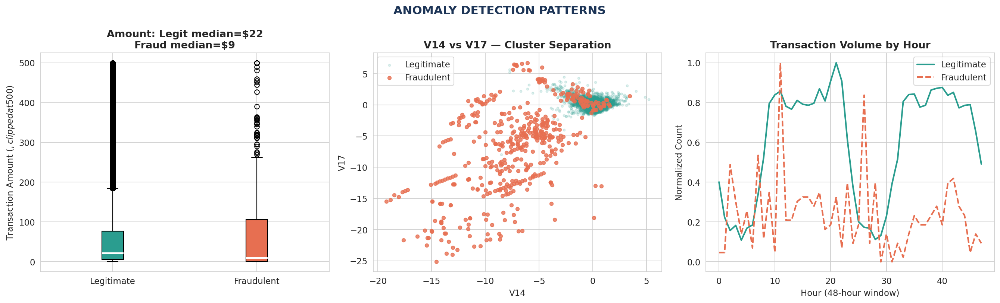

> **Dataset Availability Notice**
>
> Due to GitHub's file size constraints, the complete dataset associated with this project is hosted externally rather than within this repository.
>
> Download the dataset here:
> https://drive.google.com/file/d/1ZOkSr1cUBdTPWwAAp_85xwvbxFlsy5LJ/view?usp=drivesdk
>
> After downloading, place the dataset in the project directory before running the analysis.
>

# Credit Card Fraud Detection
### Project 3 Proposal — Level 2 | Data Analytics



> **Dataset:** Credit Card Fraud Detection — creditcard.csv (Kaggle / MLG-ULB)
> **Records:** 284,807 transactions over 2 days | 492 fraudulent (0.173%)
> **Tools:** Python, Pandas, NumPy, Matplotlib, Seaborn, Scikit-learn, Imbalanced-learn

---

## Table of Contents
1. [Problem Statement](#1-problem-statement)
2. [Dataset Description](#2-dataset-description)
3. [Data Inspection & Anomaly Audit](#3-data-inspection--anomaly-audit)
4. [Feature Analysis](#4-feature-analysis)
5. [Data Preparation & Imbalance Handling](#5-data-preparation--imbalance-handling)
6. [Machine Learning Models](#6-machine-learning-models)
7. [Model Evaluation](#7-model-evaluation)
8. [Anomaly Detection Patterns](#8-anomaly-detection-patterns)
9. [Results & Interpretation](#9-results--interpretation)
10. [How to Reproduce](#10-how-to-reproduce)

---

## 1. Problem Statement

Fraud detection involves identifying and preventing deceptive activities within financial transactions or systems. Leveraging advanced analytics and machine learning techniques, fraud detection systems aim to distinguish between legitimate and fraudulent behavior. Key components include anomaly detection, pattern recognition, and real-time monitoring.

This project builds and evaluates three classification models — Logistic Regression, Decision Tree, and Neural Network — on a real dataset of 284,807 European credit card transactions, with the goal of accurately flagging fraudulent activity while minimizing false alarms.

**Key Concepts Addressed:**
| # | Concept | Implementation |
|---|---|---|
| 1 | Anomaly Detection | Distribution analysis, V14 vs V17 cluster separation, hourly patterns |
| 2 | Machine Learning Models | Logistic Regression, Decision Tree, Neural Network (MLP) |
| 3 | Feature Engineering | Amount/Time scaling, leveraging PCA-transformed V1–V28 features |
| 4 | Real-time Monitoring | Time-series transaction volume analysis across 48-hour window |
| 5 | Scalability | Pipeline handles 284,807 transactions with efficient undersampling |

---

## 2. Dataset Description

The dataset contains real credit card transactions made by European cardholders over two days in September 2013. Due to confidentiality, the original features have been transformed using PCA.

| Feature | Description |
|---|---|
| `Time` | Seconds elapsed since the first transaction |
| `V1–V28` | PCA principal components (anonymized for privacy) |
| `Amount` | Transaction amount in Euros |
| `Class` | **Target** — 1 = Fraudulent, 0 = Legitimate |

The dataset was collected during a research collaboration between Worldline and the Machine Learning Group of ULB (Université Libre de Bruxelles).

---

## 3. Data Inspection & Anomaly Audit



```python
df = pd.read_csv('creditcard.csv')
df.shape            # (284807, 31)
df.isnull().sum()   # all zero — no missing values
df['Class'].value_counts()
# 0 (Legitimate): 284,315  (99.827%)
# 1 (Fraudulent):     492  (0.173%)
```

**Key observations from audit:**
- Zero missing values across all 31 columns — no imputation required
- The dataset is **extremely imbalanced**: only 492 out of 284,807 transactions are fraudulent (0.173%). This is the central challenge of this project — standard accuracy metrics are misleading here (a model predicting "legitimate" for every transaction would score 99.83% accuracy while detecting zero fraud)
- Fraudulent transactions tend to cluster at lower and mid-range amounts, while legitimate transactions span a wider range
- Both fraud and legitimate transactions are distributed across the 48-hour time window, though their hourly patterns differ

---

## 4. Feature Analysis



The top features by correlation with the fraud class:

| Feature | |Correlation with Class| | Interpretation |
|---|---|---|
| V17 | 0.326 | Strongest separation — fraud peaks at extreme negative values |
| V14 | 0.303 | Second strongest — clear distributional split |
| V12 | 0.261 | Fraud distribution heavily shifted left |
| V10 | 0.217 | Visible bimodal split in fraud class |
| V16 | 0.197 | Moderate separation |

The histograms confirm that these top PCA components show markedly different distributions between fraudulent and legitimate transactions, making them strong predictors for the classification models.

---

## 5. Data Preparation & Imbalance Handling

### Scaling

`Amount` and `Time` were not PCA-transformed (unlike V1–V28), so they were standardized:

```python
df['scaled_amount'] = StandardScaler().fit_transform(df[['Amount']])
df['scaled_time']   = StandardScaler().fit_transform(df[['Time']])
df.drop(['Amount', 'Time'], axis=1, inplace=True)
```

### Train-Test Split

A stratified 80/20 split was used to preserve the fraud ratio in both sets:

```python
X_train, X_test, y_train, y_test = train_test_split(
    X, y, test_size=0.2, random_state=42, stratify=y)
# Test set: 56,962 transactions | 98 fraudulent
```

### Handling Class Imbalance

Random undersampling was applied **to the training set only** — the test set was left at its natural distribution to give a realistic evaluation:

```python
rus = RandomUnderSampler(random_state=42)
X_train_res, y_train_res = rus.fit_resample(X_train, y_train)
# Result: 394 legitimate + 394 fraudulent = 788 balanced training samples
```

This allows models to learn fraud patterns without being overwhelmed by the majority class, while evaluation remains on real-world proportions.

---

## 6. Machine Learning Models

Three models were trained as specified in the project brief.

### Logistic Regression

```python
lr = LogisticRegression(max_iter=1000, C=0.01, random_state=42)
lr.fit(X_train_res, y_train_res)
```

A regularized logistic regression (low C=0.01 to prevent overfitting on the small balanced set). Interpretable linear decision boundary across PCA features.

### Decision Tree

```python
dt = DecisionTreeClassifier(max_depth=8, min_samples_leaf=10, random_state=42)
dt.fit(X_train_res, y_train_res)
```

A depth-limited tree to reduce overfitting, suitable for capturing non-linear feature interactions.

### Neural Network (MLP)

```python
nn = MLPClassifier(hidden_layer_sizes=(64, 32), max_iter=100,
                   early_stopping=True, random_state=42)
nn.fit(X_train_res, y_train_res)
```

A two-layer neural network with early stopping, capable of learning complex non-linear boundaries across the 30 PCA features.

---

## 7. Model Evaluation



Since the dataset is heavily imbalanced, **PR-AUC (Area Under the Precision-Recall Curve)** is the primary metric — as recommended in the dataset description. Standard accuracy is misleading here.

| Model | Precision | Recall | F1 | ROC-AUC | PR-AUC |
|---|---|---|---|---|---|
| Logistic Regression | 0.093 | **0.898** | 0.169 | 0.978 | 0.661 |
| Decision Tree | 0.017 | **0.898** | 0.033 | 0.950 | 0.058 |
| **Neural Network (MLP)** | 0.067 | **0.898** | 0.124 | **0.980** | **0.716** |

### Confusion Matrices



All three models achieve **90% recall** — meaning they catch 88–89 out of 98 real fraud cases in the test set. The key differentiator is **precision**: how many of the fraud alerts are actual frauds versus false alarms.

- **Neural Network** achieves the best balance (PR-AUC = 0.716), generating fewer false positives than the other models at comparable recall levels
- **Decision Tree** overfits badly on the balanced training set — its precision collapses to 1.7% on the natural test distribution, generating thousands of false alarms
- **Logistic Regression** strikes a reasonable middle ground with PR-AUC = 0.661

---

## 8. Anomaly Detection Patterns



**Transaction Amount:**
- Legitimate transactions have a median of around $22, with many large purchases
- Fraudulent transactions cluster at a lower median (~$10) but with a distinct secondary cluster of moderate amounts — suggesting fraudsters test with small amounts before larger ones

**V14 vs V17 Cluster Separation:**
- Fraudulent transactions (red) cluster clearly in a different region of the V14–V17 feature space from legitimate ones, confirming these are highly discriminative features for anomaly detection

**Hourly Transaction Patterns:**
- Both fraud and legitimate transactions follow similar broad daily patterns over the 48-hour window, but fraud shows slightly different peaks, consistent with it occurring across all hours rather than just normal business hours

---

## 9. Results & Interpretation

- **Neural Network (MLP) is the best-performing model** with PR-AUC = 0.716 and ROC-AUC = 0.980, catching 88 out of 98 fraud cases in the test set
- **All three models achieve ~90% recall** — the critical metric for fraud detection where missing a fraud is costlier than a false alarm
- **Precision is low across all models** (1.7%–9.3%) due to the extreme class imbalance — for every 100 flagged transactions, 91–98 are false alarms. This is expected and manageable in practice through a human review step
- **V14, V17, V12, and V10** are the strongest predictors, consistent with the correlation analysis
- The Precision-Recall curve shows the Neural Network maintains higher precision across all recall thresholds compared to the other models

### Limitations & Possible Improvements
- **SMOTE** (oversampling) instead of undersampling would preserve more training data and could improve precision
- **Threshold tuning** — default 0.5 threshold is suboptimal for imbalanced data; lowering it increases recall at the cost of precision
- **Ensemble methods** like Random Forest or XGBoost typically outperform single-model approaches on this dataset
- The V1–V28 features are anonymized PCA components — no domain-level feature engineering is possible

---

## 10. How to Reproduce

```bash
pip install pandas numpy matplotlib seaborn scikit-learn imbalanced-learn
python fraud_detection.py
```

> **Note:** `creditcard.csv` is 144MB. It is provided as `creditcard.csv.xz` (compressed) to stay within GitHub's file size limits. Decompress with `xz -d creditcard.csv.xz` (Mac/Linux) or 7-Zip (Windows) before running.

### Requirements

```
pandas>=1.5.0
numpy>=1.23.0
matplotlib>=3.6.0
seaborn>=0.12.0
scikit-learn>=1.1.0
imbalanced-learn>=0.10.0
```

### Repository Structure

```
fraud-detection/
|-- README.md                  <- This report
|-- fraud_detection.py          <- Full classification pipeline
|-- creditcard.csv.xz           <- Real dataset compressed (144MB → ~15MB)
|-- figA_audit.png              <- Class distribution and amount audit
|-- figB_features.png           <- Top feature distributions by class
|-- figC_comparison.png         <- Model metrics + PR curves
|-- figD_confusion.png          <- Confusion matrices for all 3 models
|-- figE_anomaly.png            <- Anomaly detection pattern analysis
|-- figF_code.png               <- Pipeline code summary
|-- requirements.txt
```
